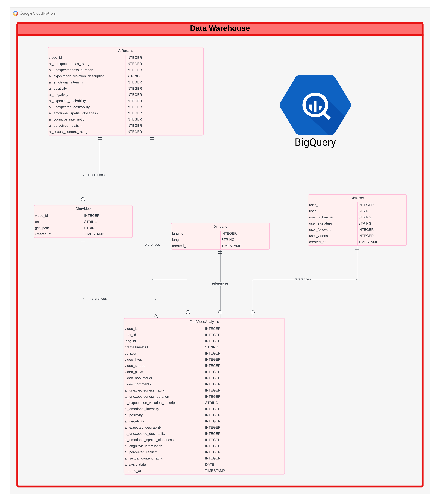

# TikTok Analytics Pipeline

## Introduction

This project builds an analytics pipeline to evaluate TikTok videos. It integrates data extraction, storage, AI processing, and warehousing to analyze engagement KPIs and AI-derived content metrics, including surprising elements.

## Overview

The primary goal of this project is to construct a robust data pipeline capable of providing insightful analytics on TikTok videos by examining both engagement metrics and AI-generated interpretative insights. Specifically, the project seeks to understand whether the conceptual elements of surprise that violet the viewers expectations in video content correlate with traditional engagement KPIs such as views, likes, shares, and comments.

**Data Consolidation and Storage:** Collect raw video data and metadata from the TikTok API, storing them efficiently in the highly scalable Google Cloud Storage. This forms the basis for subsequent data processing and analytical ventures.

**AI-Driven Video Analysis:** Leverage the Gemini LLM via Vertex AI to extract nuanced interpretations of videos, focusing on ratings of unexpectedness.

**Data Transformation and Warehousing:** Transform the raw and AI-processed data into structured formats suitable for comprehensive analysis. This involves merging AI outputs with video metadata into a star schema within BigQuery, where data is organized to optimize efficiency and accessibility for analytical tasks.

**Insight Derivation and Validation:** Use advanced data analysis to explore and quantify the relationship between a video's surprising content and its engagement KPIs. This aspect of the project includes validating AI model outputs against predetermined benchmarks and psychological insights on surprise, achieved through RAG techniques.

Ultimately, the project endeavors to provide a unique insight into the impact of content creativity and emotional resonance on social media engagement. This approach positions the project at the intersection of psychology, data science, and digital marketing, aiming to enhance understanding of audience interactions and content efficacy on platforms like TikTok.

### Google Cloud Services   
Storage: Google Cloud Storage is used to house raw video files and their metadata, facilitating subsequent processing phases.   
Vertex AI: Utilized for running the Gemini LLM model, performing video analysis by generating synthetic insights on unexpectedness ratings.   
BigQuery: Acts as the data warehouse where processed data is loaded. It supports the creation of a star schema to store transformed data combining both TikTok metadata and AI-generated insights.   

## Detailed Pipeline Flow

<table>
  <tr>
    <td>
      <table>
        
      </table>
    </td>
    <td>
      <table>
        
      </table>
    </td>
  </tr>
</table>

### Data Extraction and Storage 
The TikTok API is used to fetch videos and metadata which are stored in a Google Cloud Storage bucket. Video files are downloaded and directly uploaded into GCS.

### AI Processing 
The Vertex AI platform is set up with the Gemini LLM, analyzing individual video files. The AI model is tasked with determining metrics such as unexpectedness, predicted emotional reponse intensity, and expectation gaps using structured prompts. These insights are produced in a JSON schema format, ensuring interoperability with subsequent data processing tools.

### Data Transformation and Loading:   
Processed insights from the Gemini LLM, along with TikTok metadata, are transferred to a BigQuery data warehouse where data is organized into a star schema. The schema includes dimension tables (dim_user, dim_video, dim_lang) and a fact table (fact_video_analytics), capturing both engagement KPIs and AI-derived metrics.

### Analysis and Insights   
The resulting structured tables allow for in-depth analysis of how unexpectedness ratings and emotional intensity may correlate with traditional engagement metrics such as video views, likes, comments, and shares. This integration facilitates insights on the content aspects that drive viewer interaction.

## LLM Validation Process

The LLM validation process is a critical component of this project, designed to ensure that the AI-generated metrics on video content, specifically unexpectedness and emotional intensity, are reliable and accurate. Utilized within this framework are advanced techniques and methodologies, as depicted in the accompanying diagram.

### Input Data Preparation
The process starts with the collection of a set of pre-labeled videos. These videos have already been assessed and rated by human evaluators, establishing a benchmark for unexpectedness and emotional intensity. These human-rated videos serve as the ground truth for the LLM validation.

### Vision LLM Model Execution
The labeled videos are then passed through the Gemini Vision LLM, which has been set up on Vertex AI. The LLM receives structured prompts crafted to guide its analysis of the video content. The outcomes generated by the LLM include ratings and explanations related to the video's elements of surprise and emotional tone.

### Retrieval-Augmented Generation (RAG) Techniques
RAG techniques are employed to enhance the LLM's capability by utilizing additional contextual information. Tailored knowledge documents, including insights from psychology regarding surprise and unexpectedness, are integrated into the RAG process. These documents help refine the LLM’s understanding, allowing it to produce outputs more aligned with human expectations. Adjustments to the RAG setup are made based on continuous verification outcomes.

### Verification Against Human Benchmarks
The results from the LLM are systematically compared to the pre-existing human ratings of video unexpectedness and emotional intensity. This step is crucial for assessing how closely the AI's results align with the human benchmark. Discrepancies identified during this verification phase highlight areas where the model or prompt configurations may require refinement or adjustment.

### Refinement of Prompts and Knowledge Documents
Based on the verification phase feedback, both the prompts guiding the LLM and the knowledge documents used in the RAG process undergo iterative refinement. This step is essential to improve alignment between the LLM’s outputs and human assessments.

### Logging and Best Settings Identification
Through multiple iterations, the process logs various settings and configurations. By assessing these logs, the project identifies the combinations that yield the most accurate LLM outputs. These are defined as the best settings, which optimize the model's performance for future analyses.

The LLM validation process effectively ensures the reliability of AI-generated insights, essential for integrating these novel metrics with traditional engagement KPIs. Each step of this process contributes to refining the AI model, ensuring that the AI-derived metrics are both meaningful and actionable in the context of video content analysis.

## Conclusion
This project showcases an integration of cloud services to transform TikTok video data into a structured format that blends both hard engagement metrics and soft AI-derived insights. The pipeline not only aids in assessing video performance but also offers a novel way of interpreting video content through the lens of audience surprise and emotional engagement.
